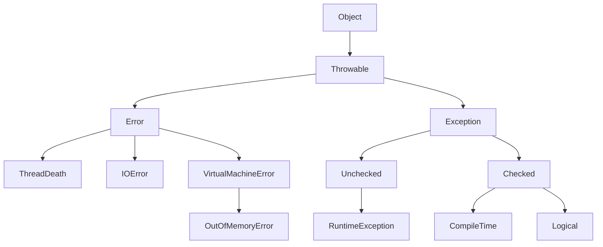

## Theory
- Java is object-oriented and platform-independent due to JVM. JVM(itself platform independent) accepts only the byte code.
- java compiler converts the java code to byte code.
- JVM is inside the JRE(Java runtime environment).
- Execution file must have a main method.
- The Java Shell tool could be used to learn java.
- On any client, JRE can be found.
- JDK contains the JRE.

### Class and Objects
- Class is a blueprint, particular object is the actual product.
- Memory in JVM can be categorized in 2: Stack memory and Heap memory.
  - For each call of a method, it is inserted into stack.
  - definitions of method are stored in heap(implementation is still in stack).
- inner and anonymous inner classes are also there.

#### Method Overloading
- Defining methods with the same name but different parameter signature.

## Features
- WORA
- Collections(lib)
- exception handling
- platform independent

### Variables
- variables inside the class are known as instance variables.
  - they are stored in heap memory.
- method defined in the main method are global variables.
- local variables are generally created inside method
  - they are part of stack memory.

### Data types
- Primitive
  - Integer: byte, short, int, long
  - Float: float, double
  - Character: char
  - Boolean: boolean

- non-Primitive
  - String

### Type Conversion and Casting
- Explicit conversion is known as type casting, note that incompatible and explicit conversion will lead to error.
- there is also the concept of type promotion.

### Operators
- __Arithmetic Operators__: + - * / %
- __Unary Operators__: ++ --
- __Assignment Operators__: += -= =
- __Relational Operators__: < > <= >= == !=
- __Logical Operators__: & | ! ^
- __Ternary operator__: ?:

### Conditional Statements: if(){} else if(){} else{}

### Statements
- switch(){ case: break; default: }
- for(initialize;check;update){}
- initialize while(check){ update; }
- initialize do{ update } while(check);

### Encapsulation(showing only what is necessary)
- `private` variable can not be accessed outside the class. others can access this through getters and setters.
- `this` keyword is helpful in differentiating the class variables to local variables. it references the current object.
- `super` : When a class implements other class, constructor of the implemented class is called first, then the constructor of the current class is called.
  - Every constructor of a class has a method `super()`(even if it not mentioned), this makes it call the constructor of the super class.
  - Every class in java extends `Object` class.
- `Anonymous` object can be created as mentioned as it can not be read/reuse.
```java
new Object();
```

### constructors(same name as class name)
- no return type of constructor is given.
- it gets runs when the object of the class is made.
- constructor can also be overloaded.

### static variables
- these variables remain same across all the instances of class.
- static variables should be referenced using the class name.
- in non-static methods, static variables can be used.
- static variables should be initialized in the `static` block in the class as this is only called once over different objects of the class.
- first the class loads(by class loader) where the static block is loaded.
- if no object is created, class will never be loaded by the loader.
- class can still be loaded without instance with the help of `class.forName()` method inside the main.
- non-static variables can not be used inside non-static methods.
- main method is static as it can be called without creating an object of the class.

### Inheritance(when a child class takes the feature of parent class)
- `extends` is used to inherit a class.
- multi-level inheritance involves the case when there is a heirarchy of inheritance.
- a class can not extend more than 1 class in java, but can implement more than 1 interfaces.
- a method can override with the help of the `Override` annotator.

#### Package
- It is a collection of classes.

#### Access specifiers
- public: it can be accessed outside/inside the package.
- protected: it can be accessed only inside the package, and outside only in subclass.
- private: it can only be accessed in the same class.
- default: it can only be accessed in the same package.

#### Object class
- it provide ssome default methods and values to use.

### Polymorphism(multi-tasking)
- there are 2 types of it: compile-time(early binding) and run-time(late binding).
- overloading covers compile time and overriding covers runtime.

### Dynamic method dispatch
- When one object can show different properties
```java
class A 
{
  public void show() {
    system.out.println("A Show");
  }
}

class B extends A
{
  public void show() {
    system.out.println("B Show");
  }
}

A obj = new A();
obj.show();
```

#### Boxing and Autoboxing
- passing a primitive data type to a non-primitive data type.

#### abstract
- an abstract method can only belong to abstract class.
- there can be no object of abstract class. it can only be extended.
- a concrete class is the one which inherits the abstract class.


#### final
- final variables can not have their value changed.
- final class can not be inherited.
- final methods can not be overridden.

#### interface
- it is just the design of the class.
- all of its methods are public abstract by default.
- an object for the interface can not be created.
- a class can implement multiple interfaces but only one abstract class.
- Types of interfaces:
  - Normal: An interface with 2 or more methods.
  - Functional/SAM(Single Abstract method): when there is only one method.
  - Marker: when there is not method(generally to store the data(matlab model ka interface in simple terms))

#### annotations(@)
- these are just decorators which can be used to add metadata to the different definitions.

### Exceptions
There are 3 types of errors:
- compile-time
- logical
- runtime



- `throw` is used to raise any exception
- new exception can be created by making a CustomException class which extends the `Exception` class.
- Resources should always be closed and in case using try with resources, close the resources in the `finally` block.

### Input handling
- println is a method of PrintStream class, but it is created as a static variable insdie the system class.
- Following are the some options to take input:
  - `System.out.read()`: it takes in the ASCII value of a char and conversion has to be done manually.
  - `BufferedReader`
  - `Scanner` class: it is better and more newer.

### Threading in java
- Whichever class' run method is to be run must extend the `Thread` class and the start mehod is called.
- __Thread Priority__
  - Priority can be given to different objects with variables of the `Thread` class.
  - There is also the `sleep` method which can be used to stop a thread for a given time.
- `Runnable` is the interface which can be used to create threads.

### Data Structures

#### Array

- size has to be declared at initialization of the innermost column.
```java
int n1[]= new int[4];
int n2[] = {1,2,3,4};
```

- Default value of array is 0.
- for multi\-dimensional array, the most innermost array can have different number of columns.
- the type of array where the number of colunms is different for different rows is called __Jagged array__.
- array is an object, so it is stored in heap. it allocated contiguous memory.
- for an array of object, it only stores reference to the object in its element.
- there are some drawbacks: longer search, inserting element overhead

#### String
- String is a class(implements java.io.serializable).
- when we initialize the string as below, JVM creates a new object and give the address to the variable s.
```java
String s = new String(original: "Traveller");
String s1 = "Traveller"; // this also creates an object
```

- some useful method are `charAt`, `concat`.
- For the below code, we only have the object but 2 variables which can reference it.
```java
String s1 = "navin"; // #3253
String s2 = "navin"; // #3253 same address as earlier one.
```

- In JVM, there is a section String Constant Pool where the strings are stored. a distinct string is only created once.
- when we change a string, a new string is created and old string is handled by the automatic garbage collection.

- Mutable vs Immutable String
  - by default, they are immutable.

#### StringBuffer
- for mutable strings, `StringBuffer` can be used. There is always an extra space of 16 butes.
- it also offers various methods such as `capacity`, `append`, `toString`, `deleteCharAt`, `insert`, `subString`, `ensureCapacity`.
- StringBuffer is thread-safe and StringBuilder is not.


